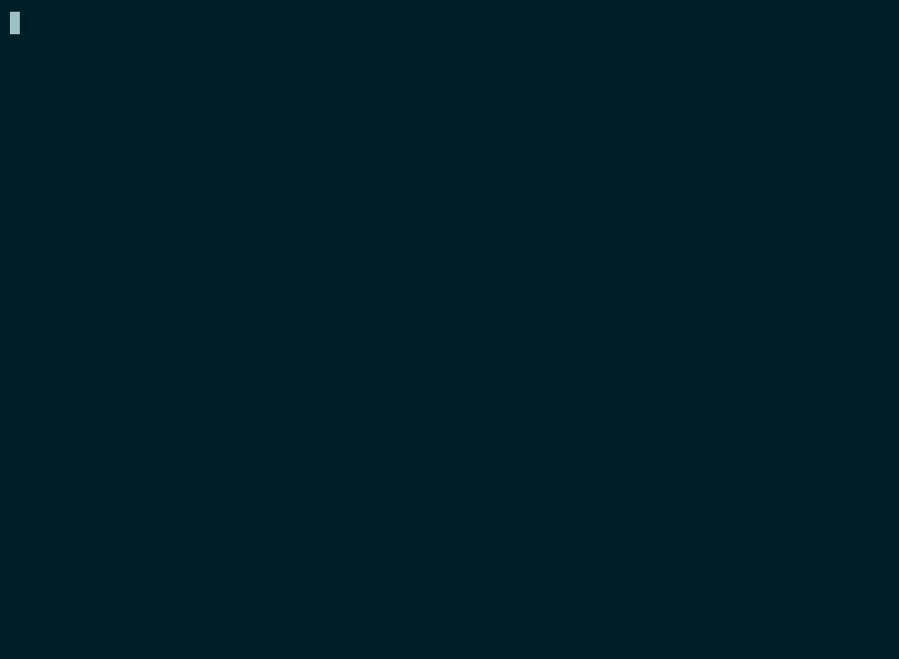

# YNode



**YNode** is a lightweight HTTP/1.1 web server written entirely in Bash. It uses [socat](http://www.dest-unreach.org/socat/) to handle network I/O and implements the full request/response cycle in shell scripts, with pluggable module handlers for static files, FastCGI (PHP-FPM), CGI, reverse proxy, health checks, and more.

> **Status:** Active development. HTTP/2 frame parsing is implemented as an exploration, but the full multiplexing stack is intentionally out of scope for now. It will most likely be implemented in Python later. See [Limitations](#limitations) for details.

---

## Why Bash?

**YNode** was built as a learning project, an attempt to implement the full HTTP/1.1 request/response cycle in a constrained language with very little network abstraction. Writing in a language with no native socket support forces every layer (connection handling, header parsing, chunked transfer encoding, content negotiation) to be explicit. It is not meant for production traffic (see [Limitations](#limitations)). It is meant to make the protocol obvious.

## Features

- **Pure Bash**: no compiled server binary required; runs anywhere Bash 4+ is available
- **SSL/TLS**: HTTPS via socat's `OPENSSL-LISTEN` with configurable certificates
- **FastCGI**: communicates with PHP-FPM over Unix sockets via the compiled C helper; responses are streamed with `Transfer-Encoding: chunked`
- **CGI**: executes CGI binaries with a clean `env -i` environment populated with standard CGI/1.1 variables
- **Reverse proxy**: forwards requests to HTTP, HTTPS, or Unix-socket upstreams with hop-by-hop header filtering and `X-Forwarded-*` injection
- **Static file serving**: ETag, `Last-Modified`, `304 Not Modified`, HTTP Range (`206 Partial Content`), and `416 Range Not Satisfiable`
- **Compression**: per-directory `static_compression` and `dynamic_compression` directives supporting `gzip`, `br`, and `zstd`
- **Chunked request bodies**: `Transfer-Encoding: chunked` uploads decoded server-side with configurable chunk and body limits
- **Per-directory routing**: `.ynaccess` files configure routing rules per directory (similar to Apache's `.htaccess`)
- **HTTP Basic Authentication**: using standard htpasswd-format password files
- **File metadata cache**: a background daemon (`file_watch.sh`) watches the document root with `inotifywait` and maintains a metadata cache for static files
- **Keep-alive**: persistent connections with configurable timeout
- **HTTP/2**: experimental frame-level implementation (not yet functional)

---

## Requirements

### Runtime

| Dependency | Purpose |
|---|---|
| `bash` 4+ | Shell environment |
| `socat` | Network listener, SSL termination, process forking |
| `file` | MIME type detection |
| `md5sum` | ETag generation |
| `stat`, `realpath` | File metadata and path normalization |
| `date` | HTTP header date formatting |
| `openssl` | TLS support, htpasswd hash verification |
| `inotifywait` | File system event monitoring (from `inotify-tools`) |
| `nc` / `ncat` | FastCGI fallback when the compiled helper is absent |

### Optional (for PHP support)

| Dependency | Purpose |
|---|---|
| `php-fpm` | FastCGI server (listens on a Unix socket or TCP address) |
| `php-cgi` | CGI binary for alternative PHP execution |

### Build (optional but recommended)

| Dependency | Purpose |
|---|---|
| `gcc` | Compile the FastCGI parameter encoder (`helper/helper`) |

---

## Building the FastCGI Helper

The C helper encodes FastCGI parameters roughly 10× faster than the pure-Bash fallback. It is optional, the server works without it, but FastCGI performance will be degraded.

```bash
make
```

To remove the compiled binary:

```bash
make clean
```

The compiled binary is placed at `helper/helper`. Set `YN_HELPER` in your config to this path.

---

## Quick Start

### 1. Generate a self-signed certificate

```bash
openssl req -x509 -newkey rsa:4096 -keyout self-cert.key -out self-cert.pem \
  -days 365 -nodes -subj "/CN=localhost"
```

### 2. Start PHP-FPM (if you need PHP support)

```bash
# Arch Linux / systemd
sudo systemctl start php-fpm

# The socket path must match YN_FCGI_URI in ynode.conf
# Default: unix:/run/php-fpm/php-fpm.sock
```

### 3. Build the helper

```bash
make
```

### 4. Start the server

```bash
# HTTPS on port 6680, serving ./www-demo
./server.sh -c config/ynode.conf -s

# HTTP (no SSL) on a custom port
./server.sh -c config/ynode.conf -w /var/www/html -p 8080

# Verbose output with a log file
./server.sh -c config/ynode.conf -s -v -l /tmp/ynode.log
```

### 5. Test

```bash
# Health check
curl -k https://127.0.0.1:6680/ping

# Static file
curl -k https://127.0.0.1:6680/ynode.png

# PHP via FastCGI
curl -k https://127.0.0.1:6680/index.php

# Password-protected path (demo)
curl -k -u user:pass https://127.0.0.1:6680/restricted
```

---

## Usage

```
Usage: server.sh [OPTIONS]

Options:
  -h, --help              Show this help message and exit
  -v, --verbose           Enable verbose output
  -d, --debug             Enable debug output
  -l, --logfile <file>    Write log output to <file>
  -c, --config <file>     Load configuration from <file> (can be repeated)
  -w, --www-root <dir>    Set the HTTP document root
  -p, --port <number>     Set the port to listen on
  -s, --ssl               Enable SSL/TLS
  -0                      Use ping mode (returns "OK" to all requests)
```

Multiple `-c` flags are processed in order, with later files overriding earlier ones:

```bash
./server.sh -c config/ynode.conf -c config/site.conf -s
```

---

## Configuration

Configuration is loaded from shell scripts sourced by `server.sh`. All variables are exported to child processes.

### Server defaults (`config/ynode.conf`)

| Variable | Default | Description |
|---|---|---|
| `YN_HTTP_SERVER_PORT` | `6680` | TCP port to listen on |
| `YN_SOCAT_BACKLOG` | `128` | `listen()` backlog passed to socat |
| `YN_MAX_TIMEOUT` | `5` | Keep-alive timeout in seconds |
| `YN_HTTP_SERVER` | `YNode/0.1` | Value of the `Server:` response header |
| `YN_SSL` | `1` | Enable SSL (`1`) or disable (``) |
| `YN_SSL_CERT` | `./self-cert.pem` | Path to SSL certificate |
| `YN_SSL_PRIVKEY` | `./self-cert.key` | Path to SSL private key |
| `YN_FCGI_URI` | `unix:/run/php-fpm/php-fpm.sock` | FastCGI Unix socket |
| `YN_HELPER` | `helper/helper` | Path to compiled FastCGI helper |
| `YN_STATIC_DATA_DIR` | `/tmp/yn-static-data-dir` | Static file metadata cache directory |
| `YN_VERBOSE` | `1` | Enable verbose logging |
| `YN_DEBUG` | `` | Enable debug logging |
| `YN_HTTP2` | `` | Enable HTTP/2 (experimental, non-functional) |

**Request limits:**

| Variable | Default | Description |
|---|---|---|
| `YN_MAX_BODY_SIZE` | `52428800` | Maximum request body size in bytes (50 MiB) |
| `YN_MAX_CHUNKS` | `8192` | Maximum number of chunks in a chunked request |

**Compression binaries and levels:**

| Variable | Default | Description |
|---|---|---|
| `YN_GZIP_BIN` | `$(which gzip)` | Path to the gzip binary |
| `YN_BROTLI_BIN` | `$(which brotli)` | Path to the brotli binary |
| `YN_ZSTD_BIN` | `$(which zstd)` | Path to the zstd binary |
| `YN_GZIP_LEVEL` | `9` | gzip level for pre-compressed static files |
| `YN_BROTLI_LEVEL` | `9` | brotli quality for pre-compressed static files |
| `YN_ZSTD_LEVEL` | `15` | zstd level for pre-compressed static files |
| `YN_GZIP_LEVEL_OTF` | `3` | gzip level for on-the-fly dynamic compression |
| `YN_BROTLI_LEVEL_OTF` | `1` | brotli quality for on-the-fly dynamic compression |
| `YN_ZSTD_LEVEL_OTF` | `1` | zstd level for on-the-fly dynamic compression |

### site-specific overrides (`config/site.conf`)

| Variable | Example | Description |
|---|---|---|
| `YN_HTTP_ROOT` | `./www-demo/` | Document root |
| `YN_DEFAULT_PAGES_DIR` | `./default_pages` | Directory containing error page HTML files |

---

## Directory Structure

```
ynode/
├── server.sh             # Main launcher
├── http1.1.sh            # HTTP/1.1 request handler
├── http0.sh              # Ping handler (minimal)
├── h2.sh                 # HTTP/2 handler (experimental)
├── h2-utils.sh           # HTTP/2 utilities
├── h2-frames.sh          # HTTP/2 frame type definitions
├── h2-func.sh            # HTTP/2 frame processing
├── http-func.sh          # Response building (headers, error pages)
├── utils.sh              # Logging, parsing, .ynaccess primitives
├── fcgi-utils.sh         # FastCGI protocol encoding
├── method_call.sh        # Request routing and .ynaccess loader
├── file_watch.sh         # Static file metadata cache daemon
│
├── modules/
│   ├── static.sh         # Serve static files
│   ├── fcgi.sh           # Forward requests to FastCGI
│   ├── cgi.sh            # Execute CGI binaries
│   ├── ping.sh           # Health check (200 OK)
│   ├── proxy.sh          # Reverse proxy (HTTP/HTTPS/Unix socket)
│   ├── redirect.sh       # 301 redirect
│   ├── temp_redirect.sh  # 302 redirect
│   ├── autoindex.sh      # Directory listing (not implemented)
│   └── unimplemented.sh  # Placeholder (returns 501)
│
├── config/
│   ├── ynode.conf        # Main server configuration
│   ├── site.conf         # Site-specific configuration
│   └── ynacces_example   # Annotated .ynaccess reference
│
├── default/
│   └── default_ynaccess  # Fallback routing rules
│
├── default_pages/        # HTML templates for HTTP error responses
│   └── 400.html … 505.html
│
├── helper/
│   ├── helper.c          # FastCGI parameter encoder / decoder
│   ├── helper.h          # FastCGI protocol definitions
│   └── hpack_helper.py   # HTTP/2 HPACK helper (unused)
│
├── www-demo/             # Example site
│   ├── .ynaccess         # Demo routing rules
│   ├── .ynpasswd         # Demo htpasswd file
│   ├── index.php
│   ├── phpinfo.php
│   └── …
│
├── Makefile              # Compiles helper/helper.c
└── LICENSE               # BSD 3-Clause
```

---

## Request Processing Flow

```
server.sh
  └─ socat TCP-LISTEN / OPENSSL-LISTEN
       └─ per connection: exec http1.1.sh

http1.1.sh
  ├─ Read request line -> parse method, path, query string
  ├─ Read headers (until blank line)
  ├─ Read body -> Content-Length or chunked Transfer-Encoding
  └─ Source method_call.sh

method_call.sh
  ├─ Canonicalize and validate path (path traversal prevention)
  ├─ Load .ynaccess from the request directory (or default_ynaccess)
  └─ Set YN_MODULE and YN_MODULE_PARAMETERS

modules/<name>.sh
  ├─ prepare_headers()  -> validate request, set response code and headers
  └─ output_content()   -> write response via output_headers() + body

http1.1.sh
  ├─ Check Connection: keep-alive
  └─ Loop for next request or close
```

---

## `.ynaccess` Routing Files

Each directory in the document root can contain a `.ynaccess` file. It is a Bash script sourced by `method_call.sh` for every request targeting that directory. It selects the backend module and applies per-request transformations.

### Available Primitives

| Primitive | Description |
|---|---|
| `is_directory` | Returns true if the requested path is a directory |
| `extension EXT …` | Returns true if the file extension matches any argument |
| `match REGEX` | Returns true if the request path matches the regex |
| `module NAME [ARGS]` | Select a handler module (see modules below) |
| `add_header NAME VALUE` | Add a header to the response |
| `auth_basic REALM [FILE]` | Require HTTP Basic Auth against an htpasswd file |
| `deny` | Return `403 Forbidden` immediately |
| `rewrite_path PATH` | Rewrite the request path before module selection |
| `rewrite_prefix FROM TO` | Strip `FROM` from the start of the path and prepend `TO` |
| `simple_http_response "CODE MSG"` | Return an immediate HTTP response (e.g. `"404 Not Found"`) |
| `static_compression ALGO MIN_SIZE` | Pre-compress static files; serve with `Content-Encoding` if the client accepts it |
| `dynamic_compression ALGO` | Compress FastCGI/CGI responses on the fly before sending |
| `force_compressed_streaming on\|off` | Stream compressed dynamic responses with `Transfer-Encoding: chunked` instead of buffering |

Variables available in `.ynaccess`:

| Variable | Description |
|---|---|
| `$YN_R_PATH` | Current request path (can be reassigned) |
| `$YN_EXTENSION` | File extension of the current request path |

### Available Modules

| Module | Description |
|---|---|
| `static` | Serve a static file with caching headers |
| `fcgi [SOCKET|IPADDR]` | Forward to a FastCGI server (defaults to `YN_FCGI_URI`) |
| `cgi BINARY` | Execute a CGI binary (standard CGI/1.1 via `env -i`) |
| `proxy URL` | Reverse-proxy to an HTTP/HTTPS upstream or Unix socket |
| `ping` | Return `200 OK` (health check) |
| `redirect` | Permanent `301` redirect |
| `temp_redirect` | Temporary `302` redirect |
| `autoindex` | HTML directory listing (not implemented) |

### Example `.ynaccess`

```bash
# Security headers applied to every response
add_header "X-Frame-Options" "DENY"
add_header "X-Content-Type-Options" "nosniff"

# Block access to .ynaccess files themselves
if match "\.ynaccess$"; then
    deny

# Health check endpoint
elif match "^/ping$"; then
    module ping

# Reverse-proxy /api/* to a Node.js backend, stripping the /api prefix
elif match "^/api/"; then
    rewrite_prefix "/api" ""
    module proxy http://127.0.0.1:3000

# Run a legacy CGI script
elif match "^/cgi/report\.cgi$"; then
    module cgi /usr/lib/cgi-bin/report.cgi

# Directory requests → index.php via FastCGI
elif is_directory; then
    rewrite_path "${YN_R_PATH}/index.php"
    dynamic_compression gzip
    module fcgi unix:/run/php-fpm.sock

# PHP files → FastCGI
elif extension "php"; then
    dynamic_compression gzip
    module fcgi unix:/run/php-fpm.sock

# Static assets: pre-compress and cache for one year
else
    add_header "Cache-Control" "max-age=31536000, public"
    static_compression br 1024
    module static
fi
```

The full reference with all available primitives is in [config/ynacces_example](config/ynacces_example).

---

## Static File Caching

YNode caches static file metadata (ETag, Content-Type, Content-Length) in `YN_STATIC_DATA_DIR` (default: `/tmp/yn-static-data-dir`). This avoids re-running `file`, `md5sum`, and `stat` on every request.

The `file_watch.sh` daemon uses `inotifywait` to monitor the document root and invalidates cache entries when files change or are deleted. The cache directory is wiped and recreated on each server start.

For conditional requests, YNode supports:

- `If-None-Match` → `304 Not Modified` (ETag comparison)
- `If-Modified-Since` → `304 Not Modified`
- `Range` → `206 Partial Content` (byte ranges)
- invalid `Range` → `416 Range Not Satisfiable` with a `Content-Range: bytes */N` header

---

## Compression

### Static compression

Pre-compress static files and serve the compressed version when the client's `Accept-Encoding` matches. The compressed file is generated on first request and cached in `YN_STATIC_DATA_DIR`.

Enable with the `static_compression` directive in `.ynaccess`:

```bash
# Compress files larger than 1024 bytes with brotli
static_compression br 1024

# Or with gzip / zstd
static_compression gzip 512
static_compression zstd 2048

# Disable
static_compression off
```

### Dynamic compression

Compress FastCGI responses on the fly. Compressible content types (`text/*`, `application/json`, `application/javascript`, etc.) are compressed before being sent. By default the body is buffered so an accurate `Content-Length` can be set.

```bash
dynamic_compression gzip
dynamic_compression br
dynamic_compression zstd
dynamic_compression off
```

### Forced chunked streaming for compressed responses

When buffering a dynamic response is undesirable (e.g. long-running SSE-like responses), enable streaming with `Transfer-Encoding: chunked` instead:

```bash
force_compressed_streaming on
```

This applies to the current `.ynaccess` scope. Streaming has slightly higher overhead per chunk but avoids holding the full response in memory.

### Compression levels

Set globally in `ynode.conf`. Two sets of levels exist: one for pre-compressed static files (higher quality, offline) and one for on-the-fly dynamic compression (lower quality, faster):

```bash
YN_GZIP_LEVEL=9        # static
YN_GZIP_LEVEL_OTF=3    # dynamic (on-the-fly)

YN_BROTLI_LEVEL=9
YN_BROTLI_LEVEL_OTF=1

YN_ZSTD_LEVEL=15
YN_ZSTD_LEVEL_OTF=1
```

---

## Chunked Request Bodies

YNode decodes `Transfer-Encoding: chunked` request bodies server-side. A request with both `Transfer-Encoding` and `Content-Length` is rejected with `400 Bad Request` (request smuggling prevention).

Limits are set in `ynode.conf`:

```bash
YN_MAX_BODY_SIZE=52428800  # 50 MiB total decoded body
YN_MAX_CHUNKS=8192         # maximum number of chunks per request
```

The decoded body length is forwarded as `CONTENT_LENGTH` to FastCGI and CGI backends.

---

## HTTP Basic Authentication

Protect a path by calling `auth_basic` in a `.ynaccess` file:

```bash
if match "^/admin"; then
    auth_basic "Admin Area" "./.ynpasswd"
fi
```

The htpasswd file uses SHA-512 crypt format, compatible with `openssl passwd -6`:

```bash
# Create a new password entry
echo "myuser:$(openssl passwd -6 'mysecret')" >> .ynpasswd
```

---

## Modules

Modules are Bash scripts in `modules/` that implement two functions:

```bash
function prepare_headers() {
    # Validate the request, set the HTTP response code,
    # and declare response headers via add_header().
}

function output_content() {
    # Emit HTTP response headers (call output_headers()),
    # then write the response body to stdout.
}
```

The module selected by `.ynaccess` is sourced into the same process as the request handler, so it has full access to all request variables (`YN_R_PATH`, `YN_HTTP_METHOD`, `YN_QUERY_STRING`, all parsed headers, etc.).

### Reverse Proxy (`proxy`)

The `proxy` module forwards the request to an HTTP, HTTPS, or Unix-socket upstream using `socat`. It:

- Strips hop-by-hop headers (`Connection`, `Transfer-Encoding`, `Upgrade`, etc.) from both directions.
- Injects `X-Forwarded-For`, `X-Forwarded-Proto`, and `X-Forwarded-Host`.
- Renames the upstream `Server` header to `X-Proxy-Server` to avoid leaking backend identity.
- Forwards the request body if one was received.
- Supports `http://HOST:PORT`, `https://HOST:PORT` (via `socat OPENSSL`), and `unix:/path/to/socket`.

```bash
# Strip /api prefix, proxy to a local Node service
elif match "^/api/"; then
    rewrite_prefix "/api" ""
    module proxy http://127.0.0.1:3000

# Proxy through a Unix socket
elif match "^/wp/"; then
    rewrite_prefix "/wp" ""
    module proxy unix:/run/nginx.sock
```

### CGI (`cgi`)

The `cgi` module executes a binary with a clean environment (`env -i`) populated with standard CGI/1.1 variables: `REQUEST_METHOD`, `SCRIPT_NAME`, `QUERY_STRING`, `CONTENT_TYPE`, `CONTENT_LENGTH`, `REMOTE_ADDR`, `SERVER_NAME`, `SERVER_PORT`, and all `HTTP_*` headers. The request body is fed via stdin.

```bash
elif match "^/report\.cgi$"; then
    module cgi /usr/lib/cgi-bin/report.cgi
```

---

## Limitations

- **HTTP/2**: frame parsing is implemented but the full stack is non-functional. Do not enable `YN_HTTP2`.
- **Autoindex module**: not yet implemented.
- **Multi-site**: single document root only; no virtual hosting.
- **Proxy keep-alive**: the proxy module sends `Connection: close` to upstream; persistent connections to backends are not reused.
- **Performance**: being Bash-based, this server is not suitable for production traffic. It is designed for development, embedded use, or educational purposes.

A detailed breakdown of every known gap, plus the roadmap, lives in [TODO.md](TODO.md).

---

## License

BSD 3-Clause. See [LICENSE](LICENSE).
